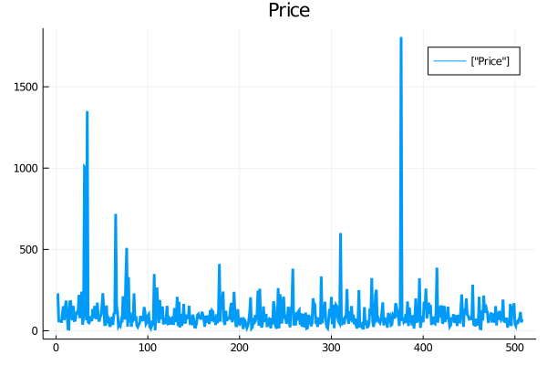
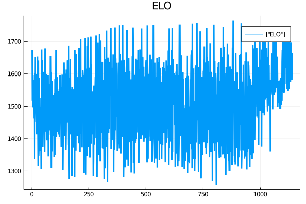
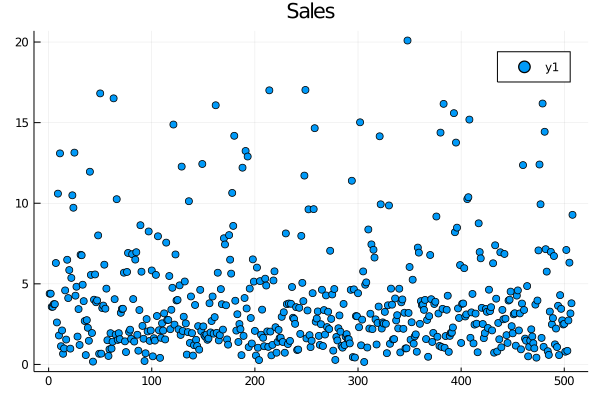
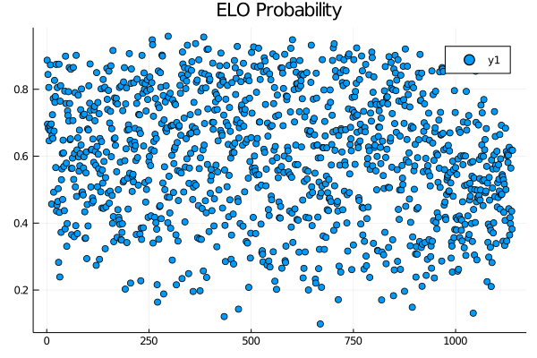

# <center>Julia for Beginners in Data Science
#### <center>C.A. O'Hara

#### Added Packages


```julia
using Pkg
Pkg.add("DataFrames") 
Pkg.add("CSV") 
Pkg.add("HTTP")
Pkg.add("Statistics")
Pkg.add("MLDataUtils")
Pkg.add("Impute")
Pkg.add("Plots")
Pkg.add("XLSX")
```

      Updating registry at `~/.julia/registries/General`
      Updating git-repo `https://github.com/JuliaRegistries/General.git`
    [?25h[1mFetching: [========================================>]  99.9 %0.0 %Fetching: [=====>                                   ]  10.3 %Fetching: [======>                                  ]  12.7 %Fetching: [=======>                                 ]  15.4 %.4 %                         ]  36.0 % [====================>                    ]  48.6 %]  61.1 %          ]  75.0 % [====================================>    ]  87.6 %Fetching: [=======================================> ]  97.2 %Fetching: [========================================>]  97.5 % Resolving package versions...
     Installed Compat ───────── v3.23.0
     Installed Parsers ──────── v1.0.11
     Installed DataStructures ─ v0.18.8
     Installed Tables ───────── v1.1.0
     Installed SentinelArrays ─ v1.2.16
      Updating `~/.julia/environments/v1.0/Project.toml`
      [a93c6f00] + DataFrames v0.21.7
      Updating `~/.julia/environments/v1.0/Manifest.toml`
      [34da2185] ↑ Compat v3.17.0 ⇒ v3.23.0
      [864edb3b] ↑ DataStructures v0.18.6 ⇒ v0.18.8
      [69de0a69] ↑ Parsers v1.0.10 ⇒ v1.0.11
      [91c51154] ↑ SentinelArrays v1.2.15 ⇒ v1.2.16
      [bd369af6] ↑ Tables v1.0.5 ⇒ v1.1.0
     Resolving package versions...
      Updating `~/.julia/environments/v1.0/Project.toml`
     [no changes]
      Updating `~/.julia/environments/v1.0/Manifest.toml`
     [no changes]
     Resolving package versions...
     Installed IniFile ─ v0.5.0
     Installed HTTP ──── v0.8.19
      Updating `~/.julia/environments/v1.0/Project.toml`
      [cd3eb016] + HTTP v0.8.19
      Updating `~/.julia/environments/v1.0/Manifest.toml`
      [cd3eb016] + HTTP v0.8.19
      [83e8ac13] + IniFile v0.5.0
     Resolving package versions...
      Updating `~/.julia/environments/v1.0/Project.toml`
      [10745b16] + Statistics 
      Updating `~/.julia/environments/v1.0/Manifest.toml`
     [no changes]
     Resolving package versions...
     Installed StatsBase ───────── v0.33.2
     Installed LearnBase ───────── v0.3.0
     Installed MLLabelUtils ────── v0.5.4
     Installed FixedPointNumbers ─ v0.8.4
     Installed MappedArrays ────── v0.3.0
     Installed MLDataPattern ───── v0.5.3
     Installed MLDataUtils ─────── v0.5.2
      Updating `~/.julia/environments/v1.0/Project.toml`
      [cc2ba9b6] + MLDataUtils v0.5.2
      Updating `~/.julia/environments/v1.0/Manifest.toml`
      [53c48c17] + FixedPointNumbers v0.8.4
      [7f8f8fb0] + LearnBase v0.3.0
      [9920b226] + MLDataPattern v0.5.3
      [cc2ba9b6] + MLDataUtils v0.5.2
      [66a33bbf] + MLLabelUtils v0.5.4
      [dbb5928d] + MappedArrays v0.3.0
      [2913bbd2] + StatsBase v0.33.2
     Resolving package versions...
     Installed IterTools ──────── v1.3.0
     Installed LearnBase ──────── v0.2.2
     Installed Distances ──────── v0.9.2
     Installed NearestNeighbors ─ v0.4.7
     Installed Impute ─────────── v0.5.1
     Installed StaticArrays ───── v0.12.5
     Installed TableOperations ── v0.2.1
     Installed DataStructures ─── v0.17.20
     Installed StatsBase ──────── v0.32.2
      Updating `~/.julia/environments/v1.0/Project.toml`
      [f7bf1975] + Impute v0.5.1
      Updating `~/.julia/environments/v1.0/Manifest.toml`
      [864edb3b] ↓ DataStructures v0.18.8 ⇒ v0.17.20
      [b4f34e82] + Distances v0.9.2
      [f7bf1975] + Impute v0.5.1
      [c8e1da08] + IterTools v1.3.0
      [7f8f8fb0] ↓ LearnBase v0.3.0 ⇒ v0.2.2
      [b8a86587] + NearestNeighbors v0.4.7
      [90137ffa] + StaticArrays v0.12.5
      [2913bbd2] ↓ StatsBase v0.33.2 ⇒ v0.32.2
      [ab02a1b2] + TableOperations v0.2.1
     Resolving package versions...
     Installed RecipesBase ───── v1.1.0
     Installed ColorTypes ────── v0.10.9
     Installed PlotUtils ─────── v1.0.7
     Installed NaNMath ───────── v0.3.4
     Installed Plots ─────────── v1.4.3
     Installed Showoff ───────── v0.3.2
     Installed RecipesPipeline ─ v0.1.13
     Installed Requires ──────── v1.1.0
     Installed PlotThemes ────── v2.0.0
     Installed FFMPEG ────────── v0.2.4
     Installed Measures ──────── v0.3.1
     Installed GeometryTypes ─── v0.8.3
     Installed Grisu ─────────── v1.0.0
     Installed Contour ───────── v0.5.5
     Installed Colors ────────── v0.12.4
     Installed ColorSchemes ──── v3.10.1
     Installed GR ────────────── v0.50.1
      Updating `~/.julia/environments/v1.0/Project.toml`
      [91a5bcdd] + Plots v1.4.3
      Updating `~/.julia/environments/v1.0/Manifest.toml`
      [35d6a980] + ColorSchemes v3.10.1
      [3da002f7] + ColorTypes v0.10.9
      [5ae59095] + Colors v0.12.4
      [d38c429a] + Contour v0.5.5
      [c87230d0] + FFMPEG v0.2.4
      [28b8d3ca] + GR v0.50.1
      [4d00f742] + GeometryTypes v0.8.3
      [42e2da0e] + Grisu v1.0.0
      [442fdcdd] + Measures v0.3.1
      [77ba4419] + NaNMath v0.3.4
      [ccf2f8ad] + PlotThemes v2.0.0
      [995b91a9] + PlotUtils v1.0.7
      [91a5bcdd] + Plots v1.4.3
      [3cdcf5f2] + RecipesBase v1.1.0
      [01d81517] + RecipesPipeline v0.1.13
      [ae029012] + Requires v1.1.0
      [992d4aef] + Showoff v0.3.2
      Building FFMPEG → `~/.julia/packages/FFMPEG/guN1x/deps/build.log`
      Building GR ────→ `~/.julia/packages/GR/Atztx/deps/build.log`
      Building Plots ─→ `~/.julia/packages/Plots/E3MWZ/deps/build.log`
     Resolving package versions...
     Installed ZipFile ─ v0.8.4
     Installed EzXML ─── v1.0.0
     Installed XLSX ──── v0.7.3
      Updating `~/.julia/environments/v1.0/Project.toml`
      [fdbf4ff8] + XLSX v0.7.3
      Updating `~/.julia/environments/v1.0/Manifest.toml`
      [8f5d6c58] + EzXML v1.0.0
      [fdbf4ff8] + XLSX v0.7.3
      [a5390f91] + ZipFile v0.8.4
      Building ZipFile → `~/.julia/packages/ZipFile/DW0Qr/deps/build.log`
      Building EzXML ──→ `~/.julia/packages/EzXML/BF7Lf/deps/build.log`


#### Creating Dictionaries


```julia
D1=Dict("The sky is blue."=>true,"Country"=>"Canada","ID#"=>2,"sales%"=>40.5)
```


    Dict{String,Any} with 4 entries:
      "The sky is blue." => true
      "sales%"           => 40.5
      "Country"          => "Canada"
      "ID#"              => 2


```julia
D1["Country"]
```


    "Canada"


## <center>🏆 Challenge
    
1) Create a dictionary, D2, with the following key and value pairs:

"animal" => "cat"
    
"fruit"  => "apple"
    
"age"    => "20"
    
    
2) Then print the value of the key "animal".


```julia
#Create dictionary
D2=Dict("fruit"=>"apple","animal"=>"cat","age"=>20)
```


    Dict{String,Any} with 3 entries:
      "fruit"  => "apple"
      "animal" => "cat"
      "age"    => 20


```julia
#View key value
D2["animal"]
```


    "cat"


### Loops

#### While Loop


```julia
length=5
a=0
b=1
i=0

while i<length
    print(a,",")
    c=a+b
    global a=b
    global b=c
    global i += 1
end
```

    0,1,1,2,3,

#### For Loop


```julia
l=["apple","orange","cherries"]
for i in l
    println(i)
end
```

    apple
    orange
    cherries


## <center>🏆 Challenge
    
Create a list l1 with the following integers:

10

20

30

Use a for loop to iterate over the integers and display them.


```julia
l1=[10,20,30]
for i in l1
    println(i)
end
```

    10
    20
    30


#### Conditional Statments


```julia
i=20
if(i<30)
    println("$i is less than 30.")
else
    println("$i is greater than 30.")
end
```

    20 is less than 30.


### Loading and Exporting Data

#### Loading from a Local System

#### CSV files


```julia
using DataFrames,CSV
data=CSV.read("nba19-20.csv")
first(data,5)
```

    ┌ Info: Precompiling DataFrames [a93c6f00-e57d-5684-b7b6-d8193f3e46c0]
    └ @ Base loading.jl:1192
    ┌ Info: Precompiling CSV [336ed68f-0bac-5ca0-87d4-7b16caf5d00b]
    └ @ Base loading.jl:1192
    ┌ Warning: `CSV.read(input; kw...)` is deprecated in favor of `using DataFrames; CSV.read(input, DataFrame; kw...)
    │   caller = read(::String) at CSV.jl:40
    └ @ CSV /home/rhyme/.julia/packages/CSV/MKemC/src/CSV.jl:40


<table class="data-frame"><thead><tr><th></th><th>date</th><th>season</th><th>neutral</th><th>playoff</th><th>team1</th><th>team2</th><th>elo1_pre</th><th>elo2_pre</th><th>elo_prob1</th></tr><tr><th></th><th>Date…</th><th>Int64</th><th>Int64</th><th>String?</th><th>String</th><th>String</th><th>Float64</th><th>Float64</th><th>Float64</th></tr></thead><tbody><p>5 rows × 24 columns (omitted printing of 15 columns)</p><tr><th>1</th><td>2019-10-22</td><td>2020</td><td>0</td><td><em>missing</em></td><td>TOR</td><td>NOP</td><td>1672.99</td><td>1415.32</td><td>0.886843</td></tr><tr><th>2</th><td>2019-10-22</td><td>2020</td><td>0</td><td><em>missing</em></td><td>LAC</td><td>LAL</td><td>1516.61</td><td>1472.91</td><td>0.695761</td></tr><tr><th>3</th><td>2019-10-23</td><td>2020</td><td>0</td><td><em>missing</em></td><td>ORL</td><td>CLE</td><td>1543.18</td><td>1349.55</td><td>0.844265</td></tr><tr><th>4</th><td>2019-10-23</td><td>2020</td><td>0</td><td><em>missing</em></td><td>IND</td><td>DET</td><td>1509.54</td><td>1475.76</td><td>0.683547</td></tr><tr><th>5</th><td>2019-10-23</td><td>2020</td><td>0</td><td><em>missing</em></td><td>CHO</td><td>CHI</td><td>1497.24</td><td>1350.43</td><td>0.805459</td></tr></tbody></table>


#### XLSX files


```julia
using XLSX
xf=XLSX.readxlsx("nba19-20.xlsx")
```

    ┌ Info: Precompiling XLSX [fdbf4ff8-1666-58a4-91e7-1b58723a45e0]
    └ @ Base loading.jl:1192


    XLSXFile("nba19-20.xlsx") containing 1 Worksheet
                sheetname size          range        
    -------------------------------------------------
                  Sheet 1 1140x24       A2:X1141     


#### Loading from a URL


```julia
using HTTP,DataFrames,CSV
df=CSV.read(HTTP.get("https://raw.githubusercontent.com/VinitaSilaparasetty/julia-beginners/master/data/s_p500companies/constituents-financials_csv.csv").body)
first(df,5)
```

    ┌ Info: Precompiling HTTP [cd3eb016-35fb-5094-929b-558a96fad6f3]
    └ @ Base loading.jl:1192
    ┌ Warning: `CSV.read(input; kw...)` is deprecated in favor of `using DataFrames; CSV.read(input, DataFrame; kw...)
    │   caller = read(::Array{UInt8,1}) at CSV.jl:40
    └ @ CSV /home/rhyme/.julia/packages/CSV/MKemC/src/CSV.jl:40


<table class="data-frame"><thead><tr><th></th><th>Symbol</th><th>Name</th><th>Sector</th><th>Price</th><th>Earnings</th><th>Dividend Yield</th><th>Share</th></tr><tr><th></th><th>String</th><th>String</th><th>String</th><th>Float64</th><th>Float64?</th><th>Float64</th><th>Float64</th></tr></thead><tbody><p>5 rows × 14 columns (omitted printing of 7 columns)</p><tr><th>1</th><td>MMM</td><td>3M Company</td><td>Industrials</td><td>222.89</td><td>24.31</td><td>2.33286</td><td>7.92</td></tr><tr><th>2</th><td>MMM</td><td>3M Company</td><td>Industrials</td><td>222.89</td><td>24.31</td><td>2.33286</td><td>7.92</td></tr><tr><th>3</th><td>AOS</td><td>A.O. Smith Corp</td><td>Industrials</td><td>60.24</td><td>27.76</td><td>1.14796</td><td>1.7</td></tr><tr><th>4</th><td>AOS</td><td>A.O. Smith Corp</td><td>Industrials</td><td>60.24</td><td>27.76</td><td>1.14796</td><td>1.7</td></tr><tr><th>5</th><td>ABT</td><td>Abbott Laboratories</td><td>Health Care</td><td>56.27</td><td>22.51</td><td>1.90898</td><td>0.26</td></tr></tbody></table>


```julia
## <center>🏆 Challenge
    
# Create the dataframe df1 and load in data from this url: 
using HTTP,DataFrames,CSV
df1=CSV.read(HTTP.get("https://raw.githubusercontent.com/VinitaSilaparasetty/julia-beginners/master/data/s_p500companies/constituents_csv.csv").body)
first(df,5)

```


<table class="data-frame"><thead><tr><th></th><th>Symbol</th><th>Name</th><th>Sector</th><th>Price</th><th>Earnings</th><th>Dividend Yield</th><th>Share</th></tr><tr><th></th><th>String</th><th>String</th><th>String</th><th>Float64</th><th>Float64?</th><th>Float64</th><th>Float64</th></tr></thead><tbody><p>5 rows × 14 columns (omitted printing of 7 columns)</p><tr><th>1</th><td>MMM</td><td>3M Company</td><td>Industrials</td><td>222.89</td><td>24.31</td><td>2.33286</td><td>7.92</td></tr><tr><th>2</th><td>MMM</td><td>3M Company</td><td>Industrials</td><td>222.89</td><td>24.31</td><td>2.33286</td><td>7.92</td></tr><tr><th>3</th><td>AOS</td><td>A.O. Smith Corp</td><td>Industrials</td><td>60.24</td><td>27.76</td><td>1.14796</td><td>1.7</td></tr><tr><th>4</th><td>AOS</td><td>A.O. Smith Corp</td><td>Industrials</td><td>60.24</td><td>27.76</td><td>1.14796</td><td>1.7</td></tr><tr><th>5</th><td>ABT</td><td>Abbott Laboratories</td><td>Health Care</td><td>56.27</td><td>22.51</td><td>1.90898</td><td>0.26</td></tr></tbody></table>


#### Export Data

#### CSV


```julia
#Use this file path:

using CSV
CSV.write("//home//rhyme//Project//Desktop//output.csv",df)
```


    SystemError: opening file //home//rhyme//Project//Desktop//output.csv: No such file or directory

    

    Stacktrace:

     [1] #systemerror#39(::Nothing, ::Function, ::String, ::Bool) at ./error.jl:106

     [2] systemerror at ./error.jl:106 [inlined]

     [3] #open#295(::Nothing, ::Nothing, ::Nothing, ::Bool, ::Nothing, ::Function, ::String) at ./iostream.jl:283

     [4] #open at ./none:0 [inlined]

     [5] open(::String, ::String) at ./iostream.jl:339

     [6] #open#296(::Base.Iterators.Pairs{Union{},Union{},Tuple{},NamedTuple{(),Tuple{}}}, ::Function, ::getfield(CSV, Symbol("##71#72")){getfield(CSV, Symbol("##64#65")){Bool,Bool,Tables.Schema{(:Symbol, :Name, :Sector, :Price, :Earnings, Symbol("Dividend Yield"), :Share, Symbol("52 Week Low"), Symbol("52 Week High"), Symbol("Market Cap"), :EBITDA, :Sales, :Price_Book, Symbol("SEC Fillings")),Tuple{String,String,String,Float64,Union{Missing, Float64},Float64,Float64,Float64,Float64,Int64,Float64,Float64,Union{Missing, Float64},Missing}},DataFrames.DataFrameRows{DataFrame,DataFrames.Index},CSV.Options{UInt8,UInt8,Nothing,Tuple{},getfield(CSV, Symbol("##59#61"))},NTuple{14,Symbol},Int32,Int32,Array{UInt8,1}}}, ::String, ::Vararg{String,N} where N) at ./iostream.jl:367

     [7] open at ./iostream.jl:367 [inlined]

     [8] with at /home/rhyme/.julia/packages/CSV/MKemC/src/write.jl:246 [inlined]

     [9] #write#63 at /home/rhyme/.julia/packages/CSV/MKemC/src/write.jl:174 [inlined]

     [10] (::getfield(CSV, Symbol("#kw##write")))(::NamedTuple{(:append, :header),Tuple{Bool,Bool}}, ::typeof(CSV.write), ::Tables.Schema{(:Symbol, :Name, :Sector, :Price, :Earnings, Symbol("Dividend Yield"), :Share, Symbol("52 Week Low"), Symbol("52 Week High"), Symbol("Market Cap"), :EBITDA, :Sales, :Price_Book, Symbol("SEC Fillings")),Tuple{String,String,String,Float64,Union{Missing, Float64},Float64,Float64,Float64,Float64,Int64,Float64,Float64,Union{Missing, Float64},Missing}}, ::DataFrames.DataFrameRows{DataFrame,DataFrames.Index}, ::String, ::CSV.Options{UInt8,UInt8,Nothing,Tuple{},getfield(CSV, Symbol("##59#61"))}) at ./none:0

     [11] #write#58(::Char, ::Char, ::Nothing, ::Nothing, ::Char, ::Char, ::Char, ::Nothing, ::Bool, ::String, ::getfield(CSV, Symbol("##59#61")), ::Bool, ::Bool, ::Nothing, ::Base.Iterators.Pairs{Union{},Union{},Tuple{},NamedTuple{(),Tuple{}}}, ::typeof(CSV.write), ::String, ::DataFrame) at /home/rhyme/.julia/packages/CSV/MKemC/src/write.jl:162

     [12] write(::String, ::DataFrame) at /home/rhyme/.julia/packages/CSV/MKemC/src/write.jl:149

     [13] top-level scope at In[19]:4


### Exploratory Data Analysis

#### Summary Statistics


```julia
show(describe(df),allrows=true,allcols=true)
```

    14×8 DataFrame
    │ Row │ variable       │ mean      │ min                    │ median     │
    │     │ Symbol         │ Union…    │ Any                    │ Union…     │
    ├─────┼────────────────┼───────────┼────────────────────────┼────────────┤
    │ 1   │ Symbol         │           │ A                      │            │
    │ 2   │ Name           │           │ 3M Company             │            │
    │ 3   │ Sector         │           │ Consumer Discretionary │            │
    │ 4   │ Price          │ 103.886   │ 2.82                   │ 73.89      │
    │ 5   │ Earnings       │ 24.8087   │ -251.53                │ 19.555     │
    │ 6   │ Dividend Yield │ 1.89537   │ 0.0                    │ 1.77972    │
    │ 7   │ Share          │ 3.75102   │ -28.01                 │ 2.89       │
    │ 8   │ 52 Week Low    │ 122.673   │ 6.59                   │ 86.61      │
    │ 9   │ 52 Week High   │ 83.5683   │ 2.8                    │ 62.77      │
    │ 10  │ Market Cap     │ 4.9444e10 │ 2626102121             │ 2.14174e10 │
    │ 11  │ EBITDA         │ 3.59943e9 │ -5.067e9               │ 1.61942e9  │
    │ 12  │ Sales          │ 3.94147   │ 0.153186               │ 2.94327    │
    │ 13  │ Price_Book     │ 14.4082   │ 0.51                   │ 3.425      │
    │ 14  │ SEC Fillings   │           │                        │            │
    
    │ Row │ max          │ nunique │ nmissing │ eltype                  │
    │     │ Any          │ Union…  │ Union…   │ Type                    │
    ├─────┼──────────────┼─────────┼──────────┼─────────────────────────┤
    │ 1   │ ZTS          │ 505     │          │ String                  │
    │ 2   │ eBay Inc.    │ 505     │          │ String                  │
    │ 3   │ Utilities    │ 11      │          │ String                  │
    │ 4   │ 1806.06      │         │          │ Float64                 │
    │ 5   │ 520.15       │         │ 2        │ Union{Missing, Float64} │
    │ 6   │ 12.6612      │         │          │ Float64                 │
    │ 7   │ 44.09        │         │          │ Float64                 │
    │ 8   │ 2067.99      │         │          │ Float64                 │
    │ 9   │ 1589.0       │         │          │ Float64                 │
    │ 10  │ 809508034020 │         │          │ Int64                   │
    │ 11  │ 7.9386e10    │         │          │ Float64                 │
    │ 12  │ 20.0943      │         │          │ Float64                 │
    │ 13  │ 1403.38      │         │ 8        │ Union{Missing, Float64} │
    │ 14  │              │         │ 508      │ Missing                 │

### Feature Selection


```julia
names(df)
```


    14-element Array{String,1}:
     "Symbol"        
     "Name"          
     "Sector"        
     "Price"         
     "Earnings"      
     "Dividend Yield"
     "Share"         
     "52 Week Low"   
     "52 Week High"  
     "Market Cap"    
     "EBITDA"        
     "Sales"         
     "Price_Book"    
     "SEC Fillings"  


#### View Total Number of Rows and Columns


```julia
size(df)
```


    (508, 14)


### Visualizations

Line Graph


```julia
using Plots
plot(df[!,4],title="Price",label=["Price"],lw=3)
```

    ┌ Info: Precompiling Plots [91a5bcdd-55d7-5caf-9e0b-520d859cae80]
    └ @ Base loading.jl:1192


    

    


```julia
## <center>🏆 Challenge
    
#Generate a line graph for the "elo1_pre" in "data". 
    
#Hint: The index of the column "elo1_pre" is 7.
using Plots
plot(data[!,7],title="ELO",label=["ELO"],lw=3)
```


    

    


#### Scatter Plot


```julia
plot(df[!,12],seriestype=:scatter,title="Sales")
```


    

    


## <center>🏆 Challenge
    
Generate a scatter plot for the "elo_prob1" in "data".
    
Hint: The index for the column "elo_prob1" is 9.


```julia
plot(data[!,9],seriestype=:scatter,title="ELO Probability")
```


    

    


### Data Cleaning

##### Remove Duplicates


```julia
using DataFrames
df=unique!(df)
```


<table class="data-frame"><thead><tr><th></th><th>Symbol</th><th>Name</th><th>Sector</th><th>Price</th><th>Earnings</th></tr><tr><th></th><th>String</th><th>String</th><th>String</th><th>Float64</th><th>Float64?</th></tr></thead><tbody><p>505 rows × 14 columns (omitted printing of 9 columns)</p><tr><th>1</th><td>MMM</td><td>3M Company</td><td>Industrials</td><td>222.89</td><td>24.31</td></tr><tr><th>2</th><td>AOS</td><td>A.O. Smith Corp</td><td>Industrials</td><td>60.24</td><td>27.76</td></tr><tr><th>3</th><td>ABT</td><td>Abbott Laboratories</td><td>Health Care</td><td>56.27</td><td>22.51</td></tr><tr><th>4</th><td>ABBV</td><td>AbbVie Inc.</td><td>Health Care</td><td>108.48</td><td>19.41</td></tr><tr><th>5</th><td>ACN</td><td>Accenture plc</td><td>Information Technology</td><td>150.51</td><td>25.47</td></tr><tr><th>6</th><td>ATVI</td><td>Activision Blizzard</td><td>Information Technology</td><td>65.83</td><td>31.8</td></tr><tr><th>7</th><td>AYI</td><td>Acuity Brands Inc</td><td>Industrials</td><td>145.41</td><td>18.22</td></tr><tr><th>8</th><td>ADBE</td><td>Adobe Systems Inc</td><td>Information Technology</td><td>185.16</td><td>52.31</td></tr><tr><th>9</th><td>AAP</td><td>Advance Auto Parts</td><td>Consumer Discretionary</td><td>109.63</td><td>19.54</td></tr><tr><th>10</th><td>AMD</td><td>Advanced Micro Devices Inc</td><td>Information Technology</td><td>11.22</td><td>187.0</td></tr><tr><th>11</th><td>AES</td><td>AES Corp</td><td>Utilities</td><td>10.06</td><td>9.96</td></tr><tr><th>12</th><td>AET</td><td>Aetna Inc</td><td>Health Care</td><td>178.0</td><td>18.11</td></tr><tr><th>13</th><td>AMG</td><td>Affiliated Managers Group Inc</td><td>Financials</td><td>179.11</td><td>12.24</td></tr><tr><th>14</th><td>AFL</td><td>AFLAC Inc</td><td>Financials</td><td>83.25</td><td>12.24</td></tr><tr><th>15</th><td>A</td><td>Agilent Technologies Inc</td><td>Health Care</td><td>65.05</td><td>27.45</td></tr><tr><th>16</th><td>APD</td><td>Air Products &amp; Chemicals Inc</td><td>Materials</td><td>152.8</td><td>24.22</td></tr><tr><th>17</th><td>AKAM</td><td>Akamai Technologies Inc</td><td>Information Technology</td><td>62.49</td><td>32.55</td></tr><tr><th>18</th><td>ALK</td><td>Alaska Air Group Inc</td><td>Industrials</td><td>64.04</td><td>9.66</td></tr><tr><th>19</th><td>ALB</td><td>Albemarle Corp</td><td>Materials</td><td>105.18</td><td>26.03</td></tr><tr><th>20</th><td>ARE</td><td>Alexandria Real Estate Equities Inc</td><td>Real Estate</td><td>114.58</td><td>19.03</td></tr><tr><th>21</th><td>ALXN</td><td>Alexion Pharmaceuticals</td><td>Health Care</td><td>108.47</td><td>22.18</td></tr><tr><th>22</th><td>ALGN</td><td>Align Technology</td><td>Health Care</td><td>220.71</td><td>56.59</td></tr><tr><th>23</th><td>ALLE</td><td>Allegion</td><td>Industrials</td><td>77.32</td><td>21.07</td></tr><tr><th>24</th><td>AGN</td><td>Allergan, Plc</td><td>Health Care</td><td>164.2</td><td>10.65</td></tr><tr><th>25</th><td>ADS</td><td>Alliance Data Systems</td><td>Information Technology</td><td>240.6</td><td>13.02</td></tr><tr><th>26</th><td>LNT</td><td>Alliant Energy Corp</td><td>Utilities</td><td>37.14</td><td>19.86</td></tr><tr><th>27</th><td>ALL</td><td>Allstate Corp</td><td>Financials</td><td>90.06</td><td>13.26</td></tr><tr><th>28</th><td>GOOGL</td><td>Alphabet Inc Class A</td><td>Information Technology</td><td>1007.71</td><td>31.48</td></tr><tr><th>29</th><td>GOOG</td><td>Alphabet Inc Class C</td><td>Information Technology</td><td>1001.52</td><td>40.29</td></tr><tr><th>30</th><td>MO</td><td>Altria Group Inc</td><td>Consumer Staples</td><td>64.05</td><td>18.89</td></tr><tr><th>&vellip;</th><td>&vellip;</td><td>&vellip;</td><td>&vellip;</td><td>&vellip;</td><td>&vellip;</td></tr></tbody></table>


### Handling Missing Values

Fill Missing Values with Mean


```julia
using Statistics
data=data[:,mean.(ismissing,eachcol(data)).<0.1]
```


<table class="data-frame"><thead><tr><th></th><th>date</th><th>season</th><th>neutral</th><th>team1</th><th>team2</th><th>elo1_pre</th><th>elo2_pre</th><th>elo_prob1</th><th>elo_prob2</th></tr><tr><th></th><th>Date…</th><th>Int64</th><th>Int64</th><th>String</th><th>String</th><th>Float64</th><th>Float64</th><th>Float64</th><th>Float64</th></tr></thead><tbody><p>1,139 rows × 17 columns (omitted printing of 8 columns)</p><tr><th>1</th><td>2019-10-22</td><td>2020</td><td>0</td><td>TOR</td><td>NOP</td><td>1672.99</td><td>1415.32</td><td>0.886843</td><td>0.113157</td></tr><tr><th>2</th><td>2019-10-22</td><td>2020</td><td>0</td><td>LAC</td><td>LAL</td><td>1516.61</td><td>1472.91</td><td>0.695761</td><td>0.304239</td></tr><tr><th>3</th><td>2019-10-23</td><td>2020</td><td>0</td><td>ORL</td><td>CLE</td><td>1543.18</td><td>1349.55</td><td>0.844265</td><td>0.155735</td></tr><tr><th>4</th><td>2019-10-23</td><td>2020</td><td>0</td><td>IND</td><td>DET</td><td>1509.54</td><td>1475.76</td><td>0.683547</td><td>0.316453</td></tr><tr><th>5</th><td>2019-10-23</td><td>2020</td><td>0</td><td>CHO</td><td>CHI</td><td>1497.24</td><td>1350.43</td><td>0.805459</td><td>0.194541</td></tr><tr><th>6</th><td>2019-10-23</td><td>2020</td><td>0</td><td>PHI</td><td>BOS</td><td>1582.4</td><td>1577.78</td><td>0.64616</td><td>0.35384</td></tr><tr><th>7</th><td>2019-10-23</td><td>2020</td><td>0</td><td>BRK</td><td>MIN</td><td>1494.77</td><td>1465.41</td><td>0.678006</td><td>0.321994</td></tr><tr><th>8</th><td>2019-10-23</td><td>2020</td><td>0</td><td>MIA</td><td>MEM</td><td>1498.75</td><td>1459.01</td><td>0.690914</td><td>0.309086</td></tr><tr><th>9</th><td>2019-10-23</td><td>2020</td><td>0</td><td>SAS</td><td>NYK</td><td>1553.99</td><td>1319.23</td><td>0.872922</td><td>0.127078</td></tr><tr><th>10</th><td>2019-10-23</td><td>2020</td><td>0</td><td>DAL</td><td>WAS</td><td>1462.2</td><td>1434.8</td><td>0.675549</td><td>0.324451</td></tr><tr><th>11</th><td>2019-10-23</td><td>2020</td><td>0</td><td>UTA</td><td>OKC</td><td>1595.63</td><td>1551.53</td><td>0.696249</td><td>0.303751</td></tr><tr><th>12</th><td>2019-10-23</td><td>2020</td><td>0</td><td>PHO</td><td>SAC</td><td>1338.14</td><td>1468.11</td><td>0.456962</td><td>0.543038</td></tr><tr><th>13</th><td>2019-10-23</td><td>2020</td><td>0</td><td>POR</td><td>DEN</td><td>1602.33</td><td>1585.76</td><td>0.661732</td><td>0.338268</td></tr><tr><th>14</th><td>2019-10-24</td><td>2020</td><td>0</td><td>DET</td><td>ATL</td><td>1490.66</td><td>1423.2</td><td>0.723917</td><td>0.276083</td></tr><tr><th>15</th><td>2019-10-24</td><td>2020</td><td>0</td><td>HOU</td><td>MIL</td><td>1652.75</td><td>1642.85</td><td>0.653086</td><td>0.346914</td></tr><tr><th>16</th><td>2019-10-24</td><td>2020</td><td>0</td><td>GSW</td><td>LAC</td><td>1634.54</td><td>1522.27</td><td>0.772401</td><td>0.227599</td></tr><tr><th>17</th><td>2019-10-25</td><td>2020</td><td>0</td><td>BOS</td><td>TOR</td><td>1569.38</td><td>1674.58</td><td>0.492518</td><td>0.507482</td></tr><tr><th>18</th><td>2019-10-25</td><td>2020</td><td>0</td><td>CHO</td><td>MIN</td><td>1498.56</td><td>1471.53</td><td>0.675078</td><td>0.324922</td></tr><tr><th>19</th><td>2019-10-25</td><td>2020</td><td>0</td><td>BRK</td><td>NYK</td><td>1488.65</td><td>1317.28</td><td>0.826663</td><td>0.173337</td></tr><tr><th>20</th><td>2019-10-25</td><td>2020</td><td>0</td><td>MEM</td><td>CHI</td><td>1450.22</td><td>1349.12</td><td>0.760902</td><td>0.239098</td></tr><tr><th>21</th><td>2019-10-25</td><td>2020</td><td>0</td><td>OKC</td><td>WAS</td><td>1547.7</td><td>1429.45</td><td>0.778391</td><td>0.221609</td></tr><tr><th>22</th><td>2019-10-25</td><td>2020</td><td>0</td><td>NOP</td><td>DAL</td><td>1413.72</td><td>1467.55</td><td>0.566059</td><td>0.433941</td></tr><tr><th>23</th><td>2019-10-25</td><td>2020</td><td>0</td><td>DEN</td><td>PHO</td><td>1599.02</td><td>1361.87</td><td>0.874434</td><td>0.125566</td></tr><tr><th>24</th><td>2019-10-25</td><td>2020</td><td>0</td><td>SAC</td><td>POR</td><td>1444.38</td><td>1589.08</td><td>0.436017</td><td>0.563983</td></tr><tr><th>25</th><td>2019-10-25</td><td>2020</td><td>0</td><td>LAL</td><td>UTA</td><td>1467.25</td><td>1599.46</td><td>0.453769</td><td>0.546231</td></tr><tr><th>26</th><td>2019-10-26</td><td>2020</td><td>0</td><td>MIL</td><td>MIA</td><td>1653.92</td><td>1507.54</td><td>0.805073</td><td>0.194927</td></tr><tr><th>27</th><td>2019-10-26</td><td>2020</td><td>0</td><td>DET</td><td>PHI</td><td>1466.17</td><td>1590.8</td><td>0.464626</td><td>0.535374</td></tr><tr><th>28</th><td>2019-10-26</td><td>2020</td><td>0</td><td>ATL</td><td>ORL</td><td>1447.69</td><td>1545.64</td><td>0.502951</td><td>0.497049</td></tr><tr><th>29</th><td>2019-10-26</td><td>2020</td><td>0</td><td>NYK</td><td>BOS</td><td>1315.48</td><td>1577.27</td><td>0.282655</td><td>0.717345</td></tr><tr><th>30</th><td>2019-10-26</td><td>2020</td><td>0</td><td>HOU</td><td>NOP</td><td>1641.67</td><td>1403.83</td><td>0.874874</td><td>0.125126</td></tr><tr><th>&vellip;</th><td>&vellip;</td><td>&vellip;</td><td>&vellip;</td><td>&vellip;</td><td>&vellip;</td><td>&vellip;</td><td>&vellip;</td><td>&vellip;</td><td>&vellip;</td></tr></tbody></table>


#### Imputing Missing Values


```julia
using DataFrames,Impute
df=Impute.interp(df)
```

    ┌ Info: Precompiling Impute [f7bf1975-0170-51b9-8c5f-a992d46b9575]
    └ @ Base loading.jl:1192


<table class="data-frame"><thead><tr><th></th><th>Symbol</th><th>Name</th><th>Sector</th><th>Price</th><th>Earnings</th></tr><tr><th></th><th>String</th><th>String</th><th>String</th><th>Float64</th><th>Float64?</th></tr></thead><tbody><p>505 rows × 14 columns (omitted printing of 9 columns)</p><tr><th>1</th><td>MMM</td><td>3M Company</td><td>Industrials</td><td>222.89</td><td>24.31</td></tr><tr><th>2</th><td>AOS</td><td>A.O. Smith Corp</td><td>Industrials</td><td>60.24</td><td>27.76</td></tr><tr><th>3</th><td>ABT</td><td>Abbott Laboratories</td><td>Health Care</td><td>56.27</td><td>22.51</td></tr><tr><th>4</th><td>ABBV</td><td>AbbVie Inc.</td><td>Health Care</td><td>108.48</td><td>19.41</td></tr><tr><th>5</th><td>ACN</td><td>Accenture plc</td><td>Information Technology</td><td>150.51</td><td>25.47</td></tr><tr><th>6</th><td>ATVI</td><td>Activision Blizzard</td><td>Information Technology</td><td>65.83</td><td>31.8</td></tr><tr><th>7</th><td>AYI</td><td>Acuity Brands Inc</td><td>Industrials</td><td>145.41</td><td>18.22</td></tr><tr><th>8</th><td>ADBE</td><td>Adobe Systems Inc</td><td>Information Technology</td><td>185.16</td><td>52.31</td></tr><tr><th>9</th><td>AAP</td><td>Advance Auto Parts</td><td>Consumer Discretionary</td><td>109.63</td><td>19.54</td></tr><tr><th>10</th><td>AMD</td><td>Advanced Micro Devices Inc</td><td>Information Technology</td><td>11.22</td><td>187.0</td></tr><tr><th>11</th><td>AES</td><td>AES Corp</td><td>Utilities</td><td>10.06</td><td>9.96</td></tr><tr><th>12</th><td>AET</td><td>Aetna Inc</td><td>Health Care</td><td>178.0</td><td>18.11</td></tr><tr><th>13</th><td>AMG</td><td>Affiliated Managers Group Inc</td><td>Financials</td><td>179.11</td><td>12.24</td></tr><tr><th>14</th><td>AFL</td><td>AFLAC Inc</td><td>Financials</td><td>83.25</td><td>12.24</td></tr><tr><th>15</th><td>A</td><td>Agilent Technologies Inc</td><td>Health Care</td><td>65.05</td><td>27.45</td></tr><tr><th>16</th><td>APD</td><td>Air Products &amp; Chemicals Inc</td><td>Materials</td><td>152.8</td><td>24.22</td></tr><tr><th>17</th><td>AKAM</td><td>Akamai Technologies Inc</td><td>Information Technology</td><td>62.49</td><td>32.55</td></tr><tr><th>18</th><td>ALK</td><td>Alaska Air Group Inc</td><td>Industrials</td><td>64.04</td><td>9.66</td></tr><tr><th>19</th><td>ALB</td><td>Albemarle Corp</td><td>Materials</td><td>105.18</td><td>26.03</td></tr><tr><th>20</th><td>ARE</td><td>Alexandria Real Estate Equities Inc</td><td>Real Estate</td><td>114.58</td><td>19.03</td></tr><tr><th>21</th><td>ALXN</td><td>Alexion Pharmaceuticals</td><td>Health Care</td><td>108.47</td><td>22.18</td></tr><tr><th>22</th><td>ALGN</td><td>Align Technology</td><td>Health Care</td><td>220.71</td><td>56.59</td></tr><tr><th>23</th><td>ALLE</td><td>Allegion</td><td>Industrials</td><td>77.32</td><td>21.07</td></tr><tr><th>24</th><td>AGN</td><td>Allergan, Plc</td><td>Health Care</td><td>164.2</td><td>10.65</td></tr><tr><th>25</th><td>ADS</td><td>Alliance Data Systems</td><td>Information Technology</td><td>240.6</td><td>13.02</td></tr><tr><th>26</th><td>LNT</td><td>Alliant Energy Corp</td><td>Utilities</td><td>37.14</td><td>19.86</td></tr><tr><th>27</th><td>ALL</td><td>Allstate Corp</td><td>Financials</td><td>90.06</td><td>13.26</td></tr><tr><th>28</th><td>GOOGL</td><td>Alphabet Inc Class A</td><td>Information Technology</td><td>1007.71</td><td>31.48</td></tr><tr><th>29</th><td>GOOG</td><td>Alphabet Inc Class C</td><td>Information Technology</td><td>1001.52</td><td>40.29</td></tr><tr><th>30</th><td>MO</td><td>Altria Group Inc</td><td>Consumer Staples</td><td>64.05</td><td>18.89</td></tr><tr><th>&vellip;</th><td>&vellip;</td><td>&vellip;</td><td>&vellip;</td><td>&vellip;</td><td>&vellip;</td></tr></tbody></table>


## <center>🏆 Challenge
    
Impute missing values in df1.


```julia
using DataFrames,Impute
df1=Impute.interp(df1)
```


<table class="data-frame"><thead><tr><th></th><th>Symbol</th><th>Name</th><th>Sector</th></tr><tr><th></th><th>String</th><th>String</th><th>String</th></tr></thead><tbody><p>505 rows × 3 columns</p><tr><th>1</th><td>MMM</td><td>3M Company</td><td>Industrials</td></tr><tr><th>2</th><td>AOS</td><td>A.O. Smith Corp</td><td>Industrials</td></tr><tr><th>3</th><td>ABT</td><td>Abbott Laboratories</td><td>Health Care</td></tr><tr><th>4</th><td>ABBV</td><td>AbbVie Inc.</td><td>Health Care</td></tr><tr><th>5</th><td>ACN</td><td>Accenture plc</td><td>Information Technology</td></tr><tr><th>6</th><td>ATVI</td><td>Activision Blizzard</td><td>Information Technology</td></tr><tr><th>7</th><td>AYI</td><td>Acuity Brands Inc</td><td>Industrials</td></tr><tr><th>8</th><td>ADBE</td><td>Adobe Systems Inc</td><td>Information Technology</td></tr><tr><th>9</th><td>AAP</td><td>Advance Auto Parts</td><td>Consumer Discretionary</td></tr><tr><th>10</th><td>AMD</td><td>Advanced Micro Devices Inc</td><td>Information Technology</td></tr><tr><th>11</th><td>AES</td><td>AES Corp</td><td>Utilities</td></tr><tr><th>12</th><td>AET</td><td>Aetna Inc</td><td>Health Care</td></tr><tr><th>13</th><td>AMG</td><td>Affiliated Managers Group Inc</td><td>Financials</td></tr><tr><th>14</th><td>AFL</td><td>AFLAC Inc</td><td>Financials</td></tr><tr><th>15</th><td>A</td><td>Agilent Technologies Inc</td><td>Health Care</td></tr><tr><th>16</th><td>APD</td><td>Air Products &amp; Chemicals Inc</td><td>Materials</td></tr><tr><th>17</th><td>AKAM</td><td>Akamai Technologies Inc</td><td>Information Technology</td></tr><tr><th>18</th><td>ALK</td><td>Alaska Air Group Inc</td><td>Industrials</td></tr><tr><th>19</th><td>ALB</td><td>Albemarle Corp</td><td>Materials</td></tr><tr><th>20</th><td>ARE</td><td>Alexandria Real Estate Equities Inc</td><td>Real Estate</td></tr><tr><th>21</th><td>ALXN</td><td>Alexion Pharmaceuticals</td><td>Health Care</td></tr><tr><th>22</th><td>ALGN</td><td>Align Technology</td><td>Health Care</td></tr><tr><th>23</th><td>ALLE</td><td>Allegion</td><td>Industrials</td></tr><tr><th>24</th><td>AGN</td><td>Allergan, Plc</td><td>Health Care</td></tr><tr><th>25</th><td>ADS</td><td>Alliance Data Systems</td><td>Information Technology</td></tr><tr><th>26</th><td>LNT</td><td>Alliant Energy Corp</td><td>Utilities</td></tr><tr><th>27</th><td>ALL</td><td>Allstate Corp</td><td>Financials</td></tr><tr><th>28</th><td>GOOGL</td><td>Alphabet Inc Class A</td><td>Information Technology</td></tr><tr><th>29</th><td>GOOG</td><td>Alphabet Inc Class C</td><td>Information Technology</td></tr><tr><th>30</th><td>MO</td><td>Altria Group Inc</td><td>Consumer Staples</td></tr><tr><th>&vellip;</th><td>&vellip;</td><td>&vellip;</td><td>&vellip;</td></tr></tbody></table>


### Sorting Data


```julia
sort!(df,rev=false)
```


<table class="data-frame"><thead><tr><th></th><th>Symbol</th><th>Name</th><th>Sector</th><th>Price</th><th>Earnings</th></tr><tr><th></th><th>String</th><th>String</th><th>String</th><th>Float64</th><th>Float64?</th></tr></thead><tbody><p>505 rows × 14 columns (omitted printing of 9 columns)</p><tr><th>1</th><td>A</td><td>Agilent Technologies Inc</td><td>Health Care</td><td>65.05</td><td>27.45</td></tr><tr><th>2</th><td>AAL</td><td>American Airlines Group</td><td>Industrials</td><td>48.6</td><td>9.92</td></tr><tr><th>3</th><td>AAP</td><td>Advance Auto Parts</td><td>Consumer Discretionary</td><td>109.63</td><td>19.54</td></tr><tr><th>4</th><td>AAPL</td><td>Apple Inc.</td><td>Information Technology</td><td>155.15</td><td>16.86</td></tr><tr><th>5</th><td>ABBV</td><td>AbbVie Inc.</td><td>Health Care</td><td>108.48</td><td>19.41</td></tr><tr><th>6</th><td>ABC</td><td>AmerisourceBergen Corp</td><td>Health Care</td><td>91.55</td><td>15.54</td></tr><tr><th>7</th><td>ABT</td><td>Abbott Laboratories</td><td>Health Care</td><td>56.27</td><td>22.51</td></tr><tr><th>8</th><td>ACN</td><td>Accenture plc</td><td>Information Technology</td><td>150.51</td><td>25.47</td></tr><tr><th>9</th><td>ADBE</td><td>Adobe Systems Inc</td><td>Information Technology</td><td>185.16</td><td>52.31</td></tr><tr><th>10</th><td>ADI</td><td>Analog Devices, Inc.</td><td>Information Technology</td><td>82.68</td><td>17.67</td></tr><tr><th>11</th><td>ADM</td><td>Archer-Daniels-Midland Co</td><td>Consumer Staples</td><td>41.35</td><td>17.45</td></tr><tr><th>12</th><td>ADP</td><td>Automatic Data Processing</td><td>Information Technology</td><td>108.25</td><td>29.34</td></tr><tr><th>13</th><td>ADS</td><td>Alliance Data Systems</td><td>Information Technology</td><td>240.6</td><td>13.02</td></tr><tr><th>14</th><td>ADSK</td><td>Autodesk Inc</td><td>Information Technology</td><td>104.81</td><td>-77.07</td></tr><tr><th>15</th><td>AEE</td><td>Ameren Corp</td><td>Utilities</td><td>52.59</td><td>20.38</td></tr><tr><th>16</th><td>AEP</td><td>American Electric Power</td><td>Utilities</td><td>63.38</td><td>17.32</td></tr><tr><th>17</th><td>AES</td><td>AES Corp</td><td>Utilities</td><td>10.06</td><td>9.96</td></tr><tr><th>18</th><td>AET</td><td>Aetna Inc</td><td>Health Care</td><td>178.0</td><td>18.11</td></tr><tr><th>19</th><td>AFL</td><td>AFLAC Inc</td><td>Financials</td><td>83.25</td><td>12.24</td></tr><tr><th>20</th><td>AGN</td><td>Allergan, Plc</td><td>Health Care</td><td>164.2</td><td>10.65</td></tr><tr><th>21</th><td>AIG</td><td>American International Group, Inc.</td><td>Financials</td><td>58.28</td><td>23.22</td></tr><tr><th>22</th><td>AIV</td><td>Apartment Investment &amp; Management</td><td>Real Estate</td><td>38.21</td><td>15.6</td></tr><tr><th>23</th><td>AIZ</td><td>Assurant Inc</td><td>Financials</td><td>85.16</td><td>33.27</td></tr><tr><th>24</th><td>AJG</td><td>Arthur J. Gallagher &amp; Co.</td><td>Financials</td><td>64.4</td><td>21.05</td></tr><tr><th>25</th><td>AKAM</td><td>Akamai Technologies Inc</td><td>Information Technology</td><td>62.49</td><td>32.55</td></tr><tr><th>26</th><td>ALB</td><td>Albemarle Corp</td><td>Materials</td><td>105.18</td><td>26.03</td></tr><tr><th>27</th><td>ALGN</td><td>Align Technology</td><td>Health Care</td><td>220.71</td><td>56.59</td></tr><tr><th>28</th><td>ALK</td><td>Alaska Air Group Inc</td><td>Industrials</td><td>64.04</td><td>9.66</td></tr><tr><th>29</th><td>ALL</td><td>Allstate Corp</td><td>Financials</td><td>90.06</td><td>13.26</td></tr><tr><th>30</th><td>ALLE</td><td>Allegion</td><td>Industrials</td><td>77.32</td><td>21.07</td></tr><tr><th>&vellip;</th><td>&vellip;</td><td>&vellip;</td><td>&vellip;</td><td>&vellip;</td><td>&vellip;</td></tr></tbody></table>


## <center>🏆 Challenge
    
Sort df in descending order.


```julia
sort!(df,rev=true)
```


<table class="data-frame"><thead><tr><th></th><th>Symbol</th><th>Name</th><th>Sector</th><th>Price</th><th>Earnings</th></tr><tr><th></th><th>String</th><th>String</th><th>String</th><th>Float64</th><th>Float64?</th></tr></thead><tbody><p>505 rows × 14 columns (omitted printing of 9 columns)</p><tr><th>1</th><td>ZTS</td><td>Zoetis</td><td>Health Care</td><td>71.51</td><td>32.8</td></tr><tr><th>2</th><td>ZION</td><td>Zions Bancorp</td><td>Financials</td><td>50.71</td><td>17.73</td></tr><tr><th>3</th><td>ZBH</td><td>Zimmer Biomet Holdings</td><td>Health Care</td><td>115.53</td><td>14.32</td></tr><tr><th>4</th><td>YUM</td><td>Yum! Brands Inc</td><td>Consumer Discretionary</td><td>76.3</td><td>27.25</td></tr><tr><th>5</th><td>XYL</td><td>Xylem Inc.</td><td>Industrials</td><td>70.24</td><td>30.94</td></tr><tr><th>6</th><td>XRX</td><td>Xerox Corp.</td><td>Information Technology</td><td>29.8</td><td>8.87</td></tr><tr><th>7</th><td>XRAY</td><td>Dentsply Sirona</td><td>Health Care</td><td>56.85</td><td>22.65</td></tr><tr><th>8</th><td>XOM</td><td>Exxon Mobil Corp.</td><td>Energy</td><td>76.07</td><td>21.37</td></tr><tr><th>9</th><td>XLNX</td><td>Xilinx Inc</td><td>Information Technology</td><td>62.82</td><td>27.19</td></tr><tr><th>10</th><td>XL</td><td>XL Capital</td><td>Financials</td><td>41.26</td><td>-19.93</td></tr><tr><th>11</th><td>XEL</td><td>Xcel Energy Inc</td><td>Utilities</td><td>42.44</td><td>18.14</td></tr><tr><th>12</th><td>XEC</td><td>Cimarex Energy</td><td>Energy</td><td>100.19</td><td>26.37</td></tr><tr><th>13</th><td>WYNN</td><td>Wynn Resorts Ltd</td><td>Consumer Discretionary</td><td>169.28</td><td>31.7</td></tr><tr><th>14</th><td>WYN</td><td>Wyndham Worldwide</td><td>Consumer Discretionary</td><td>113.56</td><td>18.77</td></tr><tr><th>15</th><td>WY</td><td>Weyerhaeuser Corp.</td><td>Real Estate</td><td>33.6</td><td>34.29</td></tr><tr><th>16</th><td>WU</td><td>Western Union Co</td><td>Information Technology</td><td>18.81</td><td>10.17</td></tr><tr><th>17</th><td>WRK</td><td>WestRock Company</td><td>Materials</td><td>60.93</td><td>23.26</td></tr><tr><th>18</th><td>WMT</td><td>Wal-Mart Stores</td><td>Consumer Staples</td><td>100.02</td><td>23.1</td></tr><tr><th>19</th><td>WMB</td><td>Williams Cos.</td><td>Energy</td><td>28.56</td><td>48.41</td></tr><tr><th>20</th><td>WM</td><td>Waste Management Inc.</td><td>Industrials</td><td>79.12</td><td>25.36</td></tr><tr><th>21</th><td>WLTW</td><td>Willis Towers Watson</td><td>Financials</td><td>152.36</td><td>18.67</td></tr><tr><th>22</th><td>WHR</td><td>Whirlpool Corp.</td><td>Consumer Discretionary</td><td>164.95</td><td>11.77</td></tr><tr><th>23</th><td>WFC</td><td>Wells Fargo</td><td>Financials</td><td>55.4</td><td>13.58</td></tr><tr><th>24</th><td>WEC</td><td>Wec Energy Group Inc</td><td>Utilities</td><td>59.5</td><td>19.57</td></tr><tr><th>25</th><td>WDC</td><td>Western Digital</td><td>Information Technology</td><td>80.09</td><td>10.19</td></tr><tr><th>26</th><td>WBA</td><td>Walgreens Boots Alliance</td><td>Consumer Staples</td><td>68.22</td><td>13.38</td></tr><tr><th>27</th><td>WAT</td><td>Waters Corporation</td><td>Health Care</td><td>191.79</td><td>26.64</td></tr><tr><th>28</th><td>VZ</td><td>Verizon Communications</td><td>Telecommunication Services</td><td>49.04</td><td>13.08</td></tr><tr><th>29</th><td>VTR</td><td>Ventas Inc</td><td>Real Estate</td><td>50.92</td><td>12.21</td></tr><tr><th>30</th><td>VRTX</td><td>Vertex Pharmaceuticals Inc</td><td>Health Care</td><td>151.6</td><td>252.67</td></tr><tr><th>&vellip;</th><td>&vellip;</td><td>&vellip;</td><td>&vellip;</td><td>&vellip;</td><td>&vellip;</td></tr></tbody></table>


### Splitting Data 


```julia
using MLDataUtils
df2,df3=splitobs(shuffleobs(df),at=(0.5,0.4))
```

    ┌ Info: Precompiling MLDataUtils [cc2ba9b6-d476-5e6d-8eaf-a92d5412d41d]
    └ @ Base loading.jl:1192


    (252×14 SubDataFrame. Omitted printing of 11 columns
    │ Row │ Symbol │ Name                           │ Sector                 │
    │     │ String │ String                         │ String                 │
    ├─────┼────────┼────────────────────────────────┼────────────────────────┤
    │ 1   │ ZBH    │ Zimmer Biomet Holdings         │ Health Care            │
    │ 2   │ GM     │ General Motors                 │ Consumer Discretionary │
    │ 3   │ DHI    │ D. R. Horton                   │ Consumer Discretionary │
    │ 4   │ BBT    │ BB&T Corporation               │ Financials             │
    │ 5   │ AMG    │ Affiliated Managers Group Inc  │ Financials             │
    │ 6   │ CVX    │ Chevron Corp.                  │ Energy                 │
    │ 7   │ SPGI   │ S&P Global, Inc.               │ Financials             │
    │ 8   │ UNM    │ Unum Group                     │ Financials             │
    │ 9   │ IP     │ International Paper            │ Materials              │
    │ 10  │ BF.B   │ Brown-Forman Corp.             │ Consumer Staples       │
    ⋮
    │ 242 │ TMO    │ Thermo Fisher Scientific       │ Health Care            │
    │ 243 │ XEC    │ Cimarex Energy                 │ Energy                 │
    │ 244 │ PSA    │ Public Storage                 │ Real Estate            │
    │ 245 │ SYK    │ Stryker Corp.                  │ Health Care            │
    │ 246 │ CTSH   │ Cognizant Technology Solutions │ Information Technology │
    │ 247 │ SPG    │ Simon Property Group Inc       │ Real Estate            │
    │ 248 │ DG     │ Dollar General                 │ Consumer Discretionary │
    │ 249 │ V      │ Visa Inc.                      │ Information Technology │
    │ 250 │ IRM    │ Iron Mountain Incorporated     │ Real Estate            │
    │ 251 │ ISRG   │ Intuitive Surgical Inc.        │ Health Care            │
    │ 252 │ JWN    │ Nordstrom                      │ Consumer Discretionary │, 202×14 SubDataFrame. Omitted printing of 11 columns
    │ Row │ Symbol │ Name                                │ Sector                 │
    │     │ String │ String                              │ String                 │
    ├─────┼────────┼─────────────────────────────────────┼────────────────────────┤
    │ 1   │ NOV    │ National Oilwell Varco Inc.         │ Energy                 │
    │ 2   │ MGM    │ MGM Resorts International           │ Consumer Discretionary │
    │ 3   │ NRG    │ NRG Energy                          │ Utilities              │
    │ 4   │ GLW    │ Corning Inc.                        │ Information Technology │
    │ 5   │ BHF    │ Brighthouse Financial Inc           │ Financials             │
    │ 6   │ ARE    │ Alexandria Real Estate Equities Inc │ Real Estate            │
    │ 7   │ RMD    │ ResMed                              │ Health Care            │
    │ 8   │ APTV   │ Aptiv Plc                           │ Consumer Discretionary │
    │ 9   │ BAX    │ Baxter International Inc.           │ Health Care            │
    │ 10  │ TROW   │ T. Rowe Price Group                 │ Financials             │
    ⋮
    │ 192 │ CCI    │ Crown Castle International Corp.    │ Real Estate            │
    │ 193 │ MHK    │ Mohawk Industries                   │ Consumer Discretionary │
    │ 194 │ STZ    │ Constellation Brands                │ Consumer Staples       │
    │ 195 │ HLT    │ Hilton Worldwide Holdings Inc       │ Consumer Discretionary │
    │ 196 │ ANTM   │ Anthem Inc.                         │ Health Care            │
    │ 197 │ DVA    │ DaVita Inc.                         │ Health Care            │
    │ 198 │ ROK    │ Rockwell Automation Inc.            │ Industrials            │
    │ 199 │ REG    │ Regency Centers Corporation         │ Real Estate            │
    │ 200 │ ABT    │ Abbott Laboratories                 │ Health Care            │
    │ 201 │ CAH    │ Cardinal Health Inc.                │ Health Care            │
    │ 202 │ ABBV   │ AbbVie Inc.                         │ Health Care            │, 51×14 SubDataFrame. Omitted printing of 11 columns
    │ Row │ Symbol │ Name                               │ Sector                 │
    │     │ String │ String                             │ String                 │
    ├─────┼────────┼────────────────────────────────────┼────────────────────────┤
    │ 1   │ AKAM   │ Akamai Technologies Inc            │ Information Technology │
    │ 2   │ OMC    │ Omnicom Group                      │ Consumer Discretionary │
    │ 3   │ MS     │ Morgan Stanley                     │ Financials             │
    │ 4   │ IQV    │ IQVIA Holdings Inc.                │ Health Care            │
    │ 5   │ AIG    │ American International Group, Inc. │ Financials             │
    │ 6   │ PX     │ Praxair Inc.                       │ Materials              │
    │ 7   │ PLD    │ Prologis                           │ Real Estate            │
    │ 8   │ AAL    │ American Airlines Group            │ Industrials            │
    │ 9   │ ABC    │ AmerisourceBergen Corp             │ Health Care            │
    │ 10  │ QCOM   │ QUALCOMM Inc.                      │ Information Technology │
    ⋮
    │ 41  │ LUV    │ Southwest Airlines                 │ Industrials            │
    │ 42  │ WU     │ Western Union Co                   │ Information Technology │
    │ 43  │ NBL    │ Noble Energy Inc                   │ Energy                 │
    │ 44  │ DLTR   │ Dollar Tree                        │ Consumer Discretionary │
    │ 45  │ IDXX   │ IDEXX Laboratories                 │ Health Care            │
    │ 46  │ SJM    │ JM Smucker                         │ Consumer Staples       │
    │ 47  │ CRM    │ Salesforce.com                     │ Information Technology │
    │ 48  │ WYNN   │ Wynn Resorts Ltd                   │ Consumer Discretionary │
    │ 49  │ WY     │ Weyerhaeuser Corp.                 │ Real Estate            │
    │ 50  │ PKI    │ PerkinElmer                        │ Health Care            │
    │ 51  │ CB     │ Chubb Limited                      │ Financials             │)


### Joining Data


```julia
df4=innerjoin(df1,df,on=:Name,makeunique=true)
```


<table class="data-frame"><thead><tr><th></th><th>Symbol</th><th>Name</th><th>Sector</th><th>Symbol_1</th><th>Sector_1</th></tr><tr><th></th><th>String</th><th>String</th><th>String</th><th>String</th><th>String</th></tr></thead><tbody><p>505 rows × 16 columns (omitted printing of 11 columns)</p><tr><th>1</th><td>MMM</td><td>3M Company</td><td>Industrials</td><td>MMM</td><td>Industrials</td></tr><tr><th>2</th><td>AOS</td><td>A.O. Smith Corp</td><td>Industrials</td><td>AOS</td><td>Industrials</td></tr><tr><th>3</th><td>ABT</td><td>Abbott Laboratories</td><td>Health Care</td><td>ABT</td><td>Health Care</td></tr><tr><th>4</th><td>ABBV</td><td>AbbVie Inc.</td><td>Health Care</td><td>ABBV</td><td>Health Care</td></tr><tr><th>5</th><td>ACN</td><td>Accenture plc</td><td>Information Technology</td><td>ACN</td><td>Information Technology</td></tr><tr><th>6</th><td>ATVI</td><td>Activision Blizzard</td><td>Information Technology</td><td>ATVI</td><td>Information Technology</td></tr><tr><th>7</th><td>AYI</td><td>Acuity Brands Inc</td><td>Industrials</td><td>AYI</td><td>Industrials</td></tr><tr><th>8</th><td>ADBE</td><td>Adobe Systems Inc</td><td>Information Technology</td><td>ADBE</td><td>Information Technology</td></tr><tr><th>9</th><td>AAP</td><td>Advance Auto Parts</td><td>Consumer Discretionary</td><td>AAP</td><td>Consumer Discretionary</td></tr><tr><th>10</th><td>AMD</td><td>Advanced Micro Devices Inc</td><td>Information Technology</td><td>AMD</td><td>Information Technology</td></tr><tr><th>11</th><td>AES</td><td>AES Corp</td><td>Utilities</td><td>AES</td><td>Utilities</td></tr><tr><th>12</th><td>AET</td><td>Aetna Inc</td><td>Health Care</td><td>AET</td><td>Health Care</td></tr><tr><th>13</th><td>AMG</td><td>Affiliated Managers Group Inc</td><td>Financials</td><td>AMG</td><td>Financials</td></tr><tr><th>14</th><td>AFL</td><td>AFLAC Inc</td><td>Financials</td><td>AFL</td><td>Financials</td></tr><tr><th>15</th><td>A</td><td>Agilent Technologies Inc</td><td>Health Care</td><td>A</td><td>Health Care</td></tr><tr><th>16</th><td>APD</td><td>Air Products &amp; Chemicals Inc</td><td>Materials</td><td>APD</td><td>Materials</td></tr><tr><th>17</th><td>AKAM</td><td>Akamai Technologies Inc</td><td>Information Technology</td><td>AKAM</td><td>Information Technology</td></tr><tr><th>18</th><td>ALK</td><td>Alaska Air Group Inc</td><td>Industrials</td><td>ALK</td><td>Industrials</td></tr><tr><th>19</th><td>ALB</td><td>Albemarle Corp</td><td>Materials</td><td>ALB</td><td>Materials</td></tr><tr><th>20</th><td>ARE</td><td>Alexandria Real Estate Equities Inc</td><td>Real Estate</td><td>ARE</td><td>Real Estate</td></tr><tr><th>21</th><td>ALXN</td><td>Alexion Pharmaceuticals</td><td>Health Care</td><td>ALXN</td><td>Health Care</td></tr><tr><th>22</th><td>ALGN</td><td>Align Technology</td><td>Health Care</td><td>ALGN</td><td>Health Care</td></tr><tr><th>23</th><td>ALLE</td><td>Allegion</td><td>Industrials</td><td>ALLE</td><td>Industrials</td></tr><tr><th>24</th><td>AGN</td><td>Allergan, Plc</td><td>Health Care</td><td>AGN</td><td>Health Care</td></tr><tr><th>25</th><td>ADS</td><td>Alliance Data Systems</td><td>Information Technology</td><td>ADS</td><td>Information Technology</td></tr><tr><th>26</th><td>LNT</td><td>Alliant Energy Corp</td><td>Utilities</td><td>LNT</td><td>Utilities</td></tr><tr><th>27</th><td>ALL</td><td>Allstate Corp</td><td>Financials</td><td>ALL</td><td>Financials</td></tr><tr><th>28</th><td>GOOGL</td><td>Alphabet Inc Class A</td><td>Information Technology</td><td>GOOGL</td><td>Information Technology</td></tr><tr><th>29</th><td>GOOG</td><td>Alphabet Inc Class C</td><td>Information Technology</td><td>GOOG</td><td>Information Technology</td></tr><tr><th>30</th><td>MO</td><td>Altria Group Inc</td><td>Consumer Staples</td><td>MO</td><td>Consumer Staples</td></tr><tr><th>&vellip;</th><td>&vellip;</td><td>&vellip;</td><td>&vellip;</td><td>&vellip;</td><td>&vellip;</td></tr></tbody></table>


## <center>🏆 Challenge
    
Do a full outer inclusive join on df1 and df, specifically in this order and call the new dataframe df5.

Hint: Use on=:Name


```julia
df5=outerjoin(df1,df,on=:Name,makeunique=true)
```


<table class="data-frame"><thead><tr><th></th><th>Symbol</th><th>Name</th><th>Sector</th><th>Symbol_1</th></tr><tr><th></th><th>String?</th><th>String?</th><th>String?</th><th>String?</th></tr></thead><tbody><p>505 rows × 16 columns (omitted printing of 12 columns)</p><tr><th>1</th><td>MMM</td><td>3M Company</td><td>Industrials</td><td>MMM</td></tr><tr><th>2</th><td>AOS</td><td>A.O. Smith Corp</td><td>Industrials</td><td>AOS</td></tr><tr><th>3</th><td>ABT</td><td>Abbott Laboratories</td><td>Health Care</td><td>ABT</td></tr><tr><th>4</th><td>ABBV</td><td>AbbVie Inc.</td><td>Health Care</td><td>ABBV</td></tr><tr><th>5</th><td>ACN</td><td>Accenture plc</td><td>Information Technology</td><td>ACN</td></tr><tr><th>6</th><td>ATVI</td><td>Activision Blizzard</td><td>Information Technology</td><td>ATVI</td></tr><tr><th>7</th><td>AYI</td><td>Acuity Brands Inc</td><td>Industrials</td><td>AYI</td></tr><tr><th>8</th><td>ADBE</td><td>Adobe Systems Inc</td><td>Information Technology</td><td>ADBE</td></tr><tr><th>9</th><td>AAP</td><td>Advance Auto Parts</td><td>Consumer Discretionary</td><td>AAP</td></tr><tr><th>10</th><td>AMD</td><td>Advanced Micro Devices Inc</td><td>Information Technology</td><td>AMD</td></tr><tr><th>11</th><td>AES</td><td>AES Corp</td><td>Utilities</td><td>AES</td></tr><tr><th>12</th><td>AET</td><td>Aetna Inc</td><td>Health Care</td><td>AET</td></tr><tr><th>13</th><td>AMG</td><td>Affiliated Managers Group Inc</td><td>Financials</td><td>AMG</td></tr><tr><th>14</th><td>AFL</td><td>AFLAC Inc</td><td>Financials</td><td>AFL</td></tr><tr><th>15</th><td>A</td><td>Agilent Technologies Inc</td><td>Health Care</td><td>A</td></tr><tr><th>16</th><td>APD</td><td>Air Products &amp; Chemicals Inc</td><td>Materials</td><td>APD</td></tr><tr><th>17</th><td>AKAM</td><td>Akamai Technologies Inc</td><td>Information Technology</td><td>AKAM</td></tr><tr><th>18</th><td>ALK</td><td>Alaska Air Group Inc</td><td>Industrials</td><td>ALK</td></tr><tr><th>19</th><td>ALB</td><td>Albemarle Corp</td><td>Materials</td><td>ALB</td></tr><tr><th>20</th><td>ARE</td><td>Alexandria Real Estate Equities Inc</td><td>Real Estate</td><td>ARE</td></tr><tr><th>21</th><td>ALXN</td><td>Alexion Pharmaceuticals</td><td>Health Care</td><td>ALXN</td></tr><tr><th>22</th><td>ALGN</td><td>Align Technology</td><td>Health Care</td><td>ALGN</td></tr><tr><th>23</th><td>ALLE</td><td>Allegion</td><td>Industrials</td><td>ALLE</td></tr><tr><th>24</th><td>AGN</td><td>Allergan, Plc</td><td>Health Care</td><td>AGN</td></tr><tr><th>25</th><td>ADS</td><td>Alliance Data Systems</td><td>Information Technology</td><td>ADS</td></tr><tr><th>26</th><td>LNT</td><td>Alliant Energy Corp</td><td>Utilities</td><td>LNT</td></tr><tr><th>27</th><td>ALL</td><td>Allstate Corp</td><td>Financials</td><td>ALL</td></tr><tr><th>28</th><td>GOOGL</td><td>Alphabet Inc Class A</td><td>Information Technology</td><td>GOOGL</td></tr><tr><th>29</th><td>GOOG</td><td>Alphabet Inc Class C</td><td>Information Technology</td><td>GOOG</td></tr><tr><th>30</th><td>MO</td><td>Altria Group Inc</td><td>Consumer Staples</td><td>MO</td></tr><tr><th>&vellip;</th><td>&vellip;</td><td>&vellip;</td><td>&vellip;</td><td>&vellip;</td></tr></tbody></table>


```julia
df4=leftjoin(df1,df,on=:Name,makeunique=true)
```


<table class="data-frame"><thead><tr><th></th><th>Symbol</th><th>Name</th><th>Sector</th><th>Symbol_1</th><th>Sector_1</th></tr><tr><th></th><th>String</th><th>String</th><th>String</th><th>String?</th><th>String?</th></tr></thead><tbody><p>505 rows × 16 columns (omitted printing of 11 columns)</p><tr><th>1</th><td>MMM</td><td>3M Company</td><td>Industrials</td><td>MMM</td><td>Industrials</td></tr><tr><th>2</th><td>AOS</td><td>A.O. Smith Corp</td><td>Industrials</td><td>AOS</td><td>Industrials</td></tr><tr><th>3</th><td>ABT</td><td>Abbott Laboratories</td><td>Health Care</td><td>ABT</td><td>Health Care</td></tr><tr><th>4</th><td>ABBV</td><td>AbbVie Inc.</td><td>Health Care</td><td>ABBV</td><td>Health Care</td></tr><tr><th>5</th><td>ACN</td><td>Accenture plc</td><td>Information Technology</td><td>ACN</td><td>Information Technology</td></tr><tr><th>6</th><td>ATVI</td><td>Activision Blizzard</td><td>Information Technology</td><td>ATVI</td><td>Information Technology</td></tr><tr><th>7</th><td>AYI</td><td>Acuity Brands Inc</td><td>Industrials</td><td>AYI</td><td>Industrials</td></tr><tr><th>8</th><td>ADBE</td><td>Adobe Systems Inc</td><td>Information Technology</td><td>ADBE</td><td>Information Technology</td></tr><tr><th>9</th><td>AAP</td><td>Advance Auto Parts</td><td>Consumer Discretionary</td><td>AAP</td><td>Consumer Discretionary</td></tr><tr><th>10</th><td>AMD</td><td>Advanced Micro Devices Inc</td><td>Information Technology</td><td>AMD</td><td>Information Technology</td></tr><tr><th>11</th><td>AES</td><td>AES Corp</td><td>Utilities</td><td>AES</td><td>Utilities</td></tr><tr><th>12</th><td>AET</td><td>Aetna Inc</td><td>Health Care</td><td>AET</td><td>Health Care</td></tr><tr><th>13</th><td>AMG</td><td>Affiliated Managers Group Inc</td><td>Financials</td><td>AMG</td><td>Financials</td></tr><tr><th>14</th><td>AFL</td><td>AFLAC Inc</td><td>Financials</td><td>AFL</td><td>Financials</td></tr><tr><th>15</th><td>A</td><td>Agilent Technologies Inc</td><td>Health Care</td><td>A</td><td>Health Care</td></tr><tr><th>16</th><td>APD</td><td>Air Products &amp; Chemicals Inc</td><td>Materials</td><td>APD</td><td>Materials</td></tr><tr><th>17</th><td>AKAM</td><td>Akamai Technologies Inc</td><td>Information Technology</td><td>AKAM</td><td>Information Technology</td></tr><tr><th>18</th><td>ALK</td><td>Alaska Air Group Inc</td><td>Industrials</td><td>ALK</td><td>Industrials</td></tr><tr><th>19</th><td>ALB</td><td>Albemarle Corp</td><td>Materials</td><td>ALB</td><td>Materials</td></tr><tr><th>20</th><td>ARE</td><td>Alexandria Real Estate Equities Inc</td><td>Real Estate</td><td>ARE</td><td>Real Estate</td></tr><tr><th>21</th><td>ALXN</td><td>Alexion Pharmaceuticals</td><td>Health Care</td><td>ALXN</td><td>Health Care</td></tr><tr><th>22</th><td>ALGN</td><td>Align Technology</td><td>Health Care</td><td>ALGN</td><td>Health Care</td></tr><tr><th>23</th><td>ALLE</td><td>Allegion</td><td>Industrials</td><td>ALLE</td><td>Industrials</td></tr><tr><th>24</th><td>AGN</td><td>Allergan, Plc</td><td>Health Care</td><td>AGN</td><td>Health Care</td></tr><tr><th>25</th><td>ADS</td><td>Alliance Data Systems</td><td>Information Technology</td><td>ADS</td><td>Information Technology</td></tr><tr><th>26</th><td>LNT</td><td>Alliant Energy Corp</td><td>Utilities</td><td>LNT</td><td>Utilities</td></tr><tr><th>27</th><td>ALL</td><td>Allstate Corp</td><td>Financials</td><td>ALL</td><td>Financials</td></tr><tr><th>28</th><td>GOOGL</td><td>Alphabet Inc Class A</td><td>Information Technology</td><td>GOOGL</td><td>Information Technology</td></tr><tr><th>29</th><td>GOOG</td><td>Alphabet Inc Class C</td><td>Information Technology</td><td>GOOG</td><td>Information Technology</td></tr><tr><th>30</th><td>MO</td><td>Altria Group Inc</td><td>Consumer Staples</td><td>MO</td><td>Consumer Staples</td></tr><tr><th>&vellip;</th><td>&vellip;</td><td>&vellip;</td><td>&vellip;</td><td>&vellip;</td><td>&vellip;</td></tr></tbody></table>


## <center>🏆 Challenge
    
Do a right inclusive join on df1 and df, specifically in this order and call the new dataframe df8.
    
Hint: Use on=:Name


```julia
df4=rightjoin(df1,df,on=:Name,makeunique=true)
```


<table class="data-frame"><thead><tr><th></th><th>Symbol</th><th>Name</th><th>Sector</th><th>Symbol_1</th><th>Sector_1</th></tr><tr><th></th><th>String?</th><th>String?</th><th>String?</th><th>String</th><th>String</th></tr></thead><tbody><p>505 rows × 16 columns (omitted printing of 11 columns)</p><tr><th>1</th><td>ZTS</td><td>Zoetis</td><td>Health Care</td><td>ZTS</td><td>Health Care</td></tr><tr><th>2</th><td>ZION</td><td>Zions Bancorp</td><td>Financials</td><td>ZION</td><td>Financials</td></tr><tr><th>3</th><td>ZBH</td><td>Zimmer Biomet Holdings</td><td>Health Care</td><td>ZBH</td><td>Health Care</td></tr><tr><th>4</th><td>YUM</td><td>Yum! Brands Inc</td><td>Consumer Discretionary</td><td>YUM</td><td>Consumer Discretionary</td></tr><tr><th>5</th><td>XYL</td><td>Xylem Inc.</td><td>Industrials</td><td>XYL</td><td>Industrials</td></tr><tr><th>6</th><td>XRX</td><td>Xerox Corp.</td><td>Information Technology</td><td>XRX</td><td>Information Technology</td></tr><tr><th>7</th><td>XRAY</td><td>Dentsply Sirona</td><td>Health Care</td><td>XRAY</td><td>Health Care</td></tr><tr><th>8</th><td>XOM</td><td>Exxon Mobil Corp.</td><td>Energy</td><td>XOM</td><td>Energy</td></tr><tr><th>9</th><td>XLNX</td><td>Xilinx Inc</td><td>Information Technology</td><td>XLNX</td><td>Information Technology</td></tr><tr><th>10</th><td>XL</td><td>XL Capital</td><td>Financials</td><td>XL</td><td>Financials</td></tr><tr><th>11</th><td>XEL</td><td>Xcel Energy Inc</td><td>Utilities</td><td>XEL</td><td>Utilities</td></tr><tr><th>12</th><td>XEC</td><td>Cimarex Energy</td><td>Energy</td><td>XEC</td><td>Energy</td></tr><tr><th>13</th><td>WYNN</td><td>Wynn Resorts Ltd</td><td>Consumer Discretionary</td><td>WYNN</td><td>Consumer Discretionary</td></tr><tr><th>14</th><td>WYN</td><td>Wyndham Worldwide</td><td>Consumer Discretionary</td><td>WYN</td><td>Consumer Discretionary</td></tr><tr><th>15</th><td>WY</td><td>Weyerhaeuser Corp.</td><td>Real Estate</td><td>WY</td><td>Real Estate</td></tr><tr><th>16</th><td>WU</td><td>Western Union Co</td><td>Information Technology</td><td>WU</td><td>Information Technology</td></tr><tr><th>17</th><td>WRK</td><td>WestRock Company</td><td>Materials</td><td>WRK</td><td>Materials</td></tr><tr><th>18</th><td>WMT</td><td>Wal-Mart Stores</td><td>Consumer Staples</td><td>WMT</td><td>Consumer Staples</td></tr><tr><th>19</th><td>WMB</td><td>Williams Cos.</td><td>Energy</td><td>WMB</td><td>Energy</td></tr><tr><th>20</th><td>WM</td><td>Waste Management Inc.</td><td>Industrials</td><td>WM</td><td>Industrials</td></tr><tr><th>21</th><td>WLTW</td><td>Willis Towers Watson</td><td>Financials</td><td>WLTW</td><td>Financials</td></tr><tr><th>22</th><td>WHR</td><td>Whirlpool Corp.</td><td>Consumer Discretionary</td><td>WHR</td><td>Consumer Discretionary</td></tr><tr><th>23</th><td>WFC</td><td>Wells Fargo</td><td>Financials</td><td>WFC</td><td>Financials</td></tr><tr><th>24</th><td>WEC</td><td>Wec Energy Group Inc</td><td>Utilities</td><td>WEC</td><td>Utilities</td></tr><tr><th>25</th><td>WDC</td><td>Western Digital</td><td>Information Technology</td><td>WDC</td><td>Information Technology</td></tr><tr><th>26</th><td>WBA</td><td>Walgreens Boots Alliance</td><td>Consumer Staples</td><td>WBA</td><td>Consumer Staples</td></tr><tr><th>27</th><td>WAT</td><td>Waters Corporation</td><td>Health Care</td><td>WAT</td><td>Health Care</td></tr><tr><th>28</th><td>VZ</td><td>Verizon Communications</td><td>Telecommunication Services</td><td>VZ</td><td>Telecommunication Services</td></tr><tr><th>29</th><td>VTR</td><td>Ventas Inc</td><td>Real Estate</td><td>VTR</td><td>Real Estate</td></tr><tr><th>30</th><td>VRTX</td><td>Vertex Pharmaceuticals Inc</td><td>Health Care</td><td>VRTX</td><td>Health Care</td></tr><tr><th>&vellip;</th><td>&vellip;</td><td>&vellip;</td><td>&vellip;</td><td>&vellip;</td><td>&vellip;</td></tr></tbody></table>


